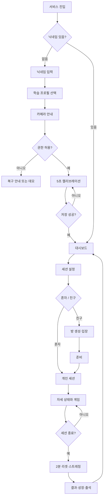
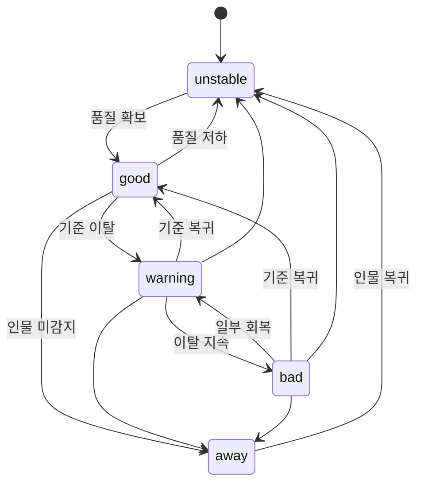

# USER FLOW

## 1. 전체 흐름



## 2. UF-01 첫 방문

```text
랜딩
→ 서비스 설명
→ 닉네임 입력
→ 도서관·내 공간·팀플 선택
→ 카메라 처리 원칙 확인
→ 권한 요청
→ 5초 기준 등록
→ 대시보드
```

### 닉네임

- 최대 12자
- 비어 있으면 `익명의 기린`
- 실명 요구 없음
- 현재 브라우저 저장

## 3. UF-02 대시보드

대시보드 우선순위:

1. 현재 캐릭터와 자세 상태
2. 25분 집중 시작
3. 성장 진행도
4. 오늘의 기록·출석
5. 친구 방
6. 최근 세션
7. 상점·설정

첫 기록이 없을 때는 빈 통계를 만들지 않고 첫 세션 CTA를 보여줍니다.

## 4. UF-03 학습 프로필

```text
프로필 선택
→ 연결된 장소 기준 확인
→ 기준 없음: 캘리브레이션
→ 기준 있음: 설정 불러오기
→ 세션 설정
```

- 도서관: 무음·작은 신호·앉은 동작
- 내 공간: 선택적 사운드·풍부한 연출·전신 동작
- 팀플: 공동 보스·합동 공격·같이 하기 쉬운 동작

## 5. UF-04 카메라와 캘리브레이션

```text
권한 전 안내
→ 브라우저 권한 요청
→ 카메라 연결
→ 얼굴·양쪽 어깨 확인
→ 5초 안정 자세
→ 품질 검사
→ 기준 요약 저장
```

### 실패

| 상태 | 처리 |
|---|---|
| 권한 거부 | 재요청·브라우저 설정·데모 |
| 인물 없음 | 프레임 중앙 안내 |
| 움직임 과다 | 카운트다운 초기화 |
| 조명 부족 | 조명·카메라 위치 안내 |
| 모델 실패 | 재시도·QA 데모 |
| 저장 실패 | 기존 기준 유지·재시도 |

## 6. UF-05 세션 설정

입력:

- 과목·과제명
- 오늘 목표
- 15·25·50분 또는 3분 데모
- 학습 프로필
- 혼자·친구
- 장착 아이템 확인

기본값은 25분입니다.

## 7. UF-06 세션 상태



## 8. UF-07 회복 성공

```text
bad 5초
→ 회복 기회 시작
→ 30초 안에 good 복귀
→ good 5초 유지
→ 회복 성공
→ 캐릭터 recover
→ 특수 공격
→ XP·포인트
→ 20초 냉각
```

실패해도 세션은 계속하고 장기 경험치를 차감하지 않습니다.

## 9. UF-08 자리 비움·불안정

### away

- 타이머 유지
- 자세·보상 정지
- 60초 후 계속·일시정지·종료
- 친구에게는 `자리 비움`만 표시

### unstable

- 타이머 유지
- 보상 정지
- 카메라·조명 복구
- 결과에 감지 가능 시간 분리

## 10. UF-09 혼자 게임

```text
세션 시작
→ 모드별 괴물(북몽이·늘몽이·꼬몽이)
→ 회복 특수 공격
→ 완주 기본 공격
→ 세션 종료
→ 스트레칭 방어막
→ 결과
```

몬스터를 처치하지 못해도 실패로 비난하지 않고 다음 세션에 이어갈 수 있습니다.

## 11. UF-10 2인 친구 방

```text
방 만들기
→ 6자리 코드·링크
→ 친구 닉네임 입장
→ 익명 인증
→ 두 사람 준비
→ 방장 시작
→ 25분 동기화
→ 성공 이벤트 공유
→ 공동 보스
→ 기린 싱크
→ 공동 결과
```

### 예외

| 상황 | 처리 |
|---|---|
| 한 명 연결 끊김 | 30초 재연결, 개인 세션 계속 |
| 방장 이탈 | 상대에게 방장 이전 |
| 재연결 실패 | 혼자 모드 전환 |
| 한 명 자리 비움 | 공동 타이머 유지, 해당 사용자 보상 정지 |
| 한 명 먼저 완료 | 완료 표시, 상대 계속 |
| 둘 다 완료 | 최종 합동 공격 |

## 12. UF-11 스트레칭

```text
세션 종료
→ 현재 모드 확인
→ 직전 동작 제외
→ 가중 랜덤 1개 추천
→ 모션·타이머
→ 완료 / 다른 동작 / 건너뛰기
→ 방어막 회복
```

건너뛰기에 불이익이 없습니다.

## 13. UF-12 결과

표시 순서:

1. 완료·중단과 세션 시간
2. 감지 가능 시간·자리 비움
3. 회복 성공 / 기회
4. 가장 빠른 회복·최고 콤보
5. 몬스터 피해량
6. XP·포인트·성장
7. 출석
8. 목표 진행도
9. 다시 시작·대시보드

## 14. UF-13 상점

```text
첫 세션 완료
→ 상점 잠금 해제
→ 과잠·백팩 보기
→ 포인트 확인
→ 구매
→ 장착
→ 캐릭터 미리보기
```

## 15. UF-14 데이터 초기화

```text
설정
→ 모든 로컬 데이터 삭제
→ 삭제 목록 확인
→ 최종 확인
→ 닉네임·기준·기록·성장·아이템 삭제
→ 첫 방문 상태
```
